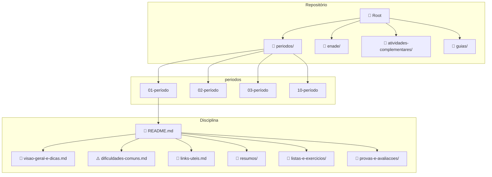

# Engenharia da Computação UABJ — Repositório Colaborativo de Disciplinas

> 📚 Um acervo colaborativo criado para organizar materiais, resumos, dicas, projetos, exercícios e orientações das disciplinas de **Engenharia da Computação da UABJ**, com o objetivo de ajudar **calouros, veteranos e futuras turmas** ao longo dos próximos anos.

---

## 📋 Sobre o projeto

Este repositório foi criado para servir como uma **base de conhecimento acadêmica colaborativa** do curso de **Engenharia da Computação da UABJ**.

A proposta é simples: reunir, organizar e manter acessíveis conteúdos que realmente ajudam a vida universitária, como:

- 📝 resumos de disciplinas;
- 📖 materiais de estudo;
- 📋 listas e exercícios;
- 💻 projetos e implementações;
- ⚠️ dificuldades comuns;
- 💡 dicas práticas;
- 🔗 links úteis;
- 🎯 orientações para estudo e preparação.

Mais do que armazenar arquivos, este repositório busca construir uma **memória coletiva do curso**, permitindo que cada turma deixe contribuições que facilitem a jornada das próximas.

---

## 🎯 Objetivos

Este projeto existe para:

- 🐣 **ajudar calouros** a entender melhor o curso, as disciplinas e os caminhos de estudo;
- 🦉 **apoiar veteranos** com materiais organizados e reutilizáveis;
- 📦 **preservar conhecimento** construído por alunos ao longo dos semestres;
- 🤝 **estimular colaboração** entre estudantes;
- 🔍 **reduzir a desorganização** causada por materiais espalhados em grupos, drives e conversas antigas;
- 🏛️ **fortalecer a comunidade acadêmica** do curso de Engenharia da Computação da UABJ.

---

## 👥 Para quem este repositório foi feito

Este repositório foi pensado para ser útil a diferentes perfis de estudantes:

### Calouros 🐣
Para quem está chegando agora e quer entender melhor:
- como o curso está estruturado;
- o que estudar em cada disciplina;
- quais são as principais dificuldades;
- por onde começar.

### Veteranos 🦉
Para quem já está no curso e quer:
- revisar conteúdos;
- consultar materiais organizados;
- reaproveitar projetos, referências e resumos;
- contribuir com sua experiência para as próximas turmas.

### Futuros colaboradores 🤝
Para quem deseja:
- adicionar materiais;
- melhorar explicações;
- corrigir informações;
- expandir o acervo do curso.

---

## 📂 Estrutura do repositório

O repositório está organizado por **períodos** e **disciplinas**, de acordo com o cronograma do curso.

### 📁 Pastas principais

| Pasta | Descrição |
|-------|-----------|
| 📅 `periodos/` | 10 períodos com todas as disciplinas do curso |
| 📝 `atividades-complementares/` | Atividades complementares obrigatórias |
| 📜 `certificacao-intermediaria/` | Certificações intermediárias |
| 📝 `enade/` | Materiais de preparação para o ENADE |
| 📖 `guias/` | Guias de Git, estágio, TCC e trilhas |
| 📋 `templates/` | Modelos para contribuições |
| ⚙️ `scripts/` | Scripts de automação |

```text
.
├── 01-periodo/          # 1º semestre
├── 02-periodo/          # 2º semestre
├── 03-periodo/          # 3º semestre
├── 04-periodo/          # 4º semestre
├── 05-periodo/          # 5º semestre
├── 06-periodo/          # 6º semestre
├── 07-periodo/          # 7º semestre
├── 08-periodo/          # 8º semestre
├── 09-periodo/          # 9º semestre
├── 10-periodo/          # 10º semestre (TCC)
├── atividades-complementares/   # Atividades complementares
├── certificacao-intermediaria/ # Certificações intermediárias
├── enade/              # Preparatório ENADE
├── guias/              # Guias gerais do curso
├── templates/           # Modelos de documentos
└── scripts/            # Scripts de automação
```

---

## 📁 Estrutura de cada disciplina

Cada disciplina segue um padrão padronizado:

```text
nome-da-disciplina/
├── README.md                    # Visão geral + ementa
├── visao-geral-e-dicas.md       # Dicas da matéria
├── dificuldades-comuns.md        # Erros frequentes
├── links-uteis.md              # Links úteis
├── extras.md                  # Conteúdos extras
├── resumos/                   # Resumos dos capítulos
├── listas-e-exercicios/        # Listas de exercício
├── provas-e-avaliacoes/        # Provas anteriores
├── projetos/                   # Projetos da disciplina
└── materiais/                 # Livros, apostilas, slides
```

---

## 📊 Exemplo de Estrutura (Mermaid)



---

## 🤝 Como contribuir

Consulte o arquivo [CONTRIBUTING.md](./CONTRIBUTING.md) para saber como contribuir com este projeto.

---

## 📜 Licença

Este projeto está sob a licença [MIT](./LICENSE).

---

*Última atualização: 17/03/2026*